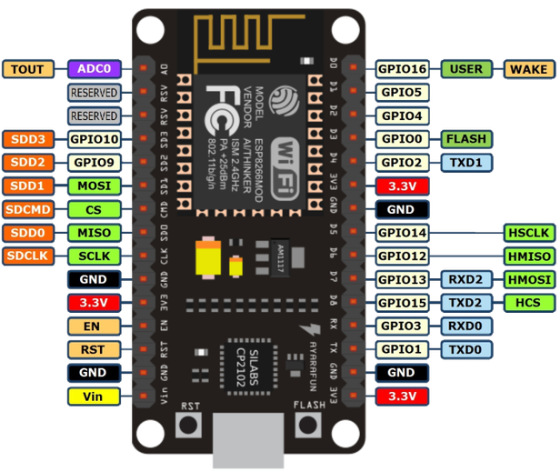
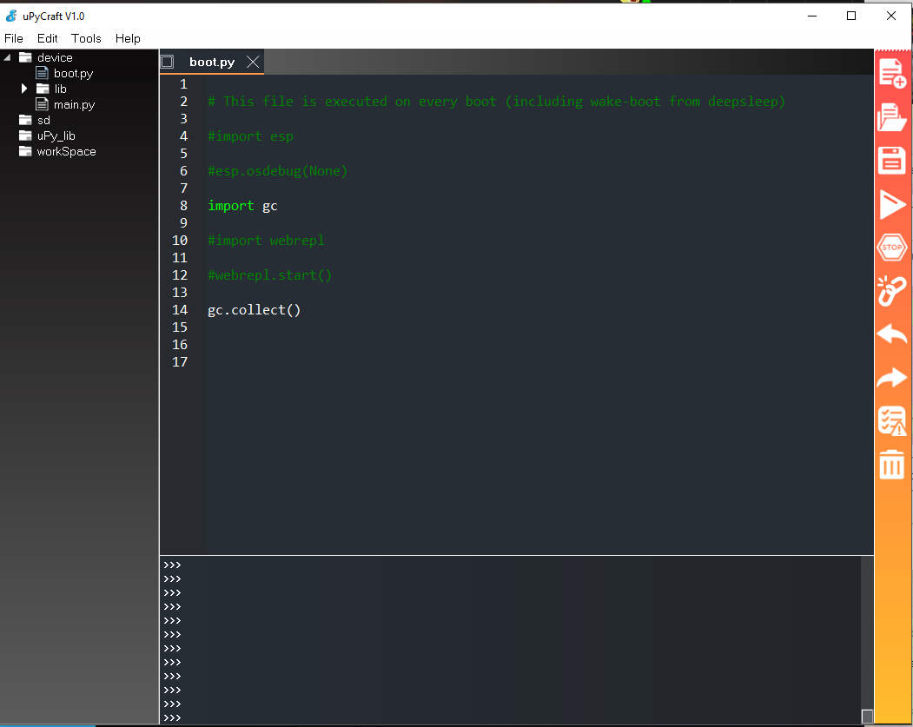

Micropython (ESP8622) By Example
================================

> MicroPython is a lean and efficient implementation of the Python 3 programming language that includes a small subset of the Python standard library and is optimised to run on microcontrollers and in constrained environments.

<p align="center">
  
</p>

### Prerequisites

- [Python](https://www.python.org/downloads/)
- [Pipenv](https://pipenv.readthedocs.io/en/latest/)
- [nodemcu-firmware](https://github.com/nodemcu/nodemcu-firmware/releases)
- [Micropython 1.9.4](https://micropython.org/download#esp8266)
- [Putty](https://www.putty.org/)
- [uPyCraft](https://dfrobot.gitbooks.io/upycraft/content/)

### Install Drivers and Identify COM port

Install the official [nodemcu-devkit drivers](https://github.com/nodemcu/nodemcu-devkit/tree/master/Drivers) for your OS.

### Flashing the ESP8266 MCU

Firstly, erase the flash memory on the MCU. Memory is typically limited to a few megabytes.

```sh
esptool --port COM3 -c esp8266 --baud 460800 erase_flash
```

Write the firmware to the devices flash storage

```sh
esptool --port COM3 -c esp8266 --baud 460800 write_flash --flash_size=detect 0 esp8266-20180511-v1.9.4.bin
```

### Connect to ESP8266 via Putty

Create a serial connection on your COM port with the correct baud rate:

- Serial Line: COM3
- Speed: 115200

A successful connection will yield a python REPL

### MicroPython REPL

Run the following in the REPL to evaluate the device is working correctly:

```python
from machine import Pin

# GPIO16 (D0) is the internal LED for NodeMCU
led_red = Pin(16, Pin.OUT)
# SETS the pin state to HIGH
led_blue.value(0)
# SETS the pin state to LOW
led_blue.value(1)
```

### Copying files to the Flash Storage

To use `ampy` directly, you will need to run `pipenv install` and `pipenv shell`.

List all files within flash storage:

```sh
ampy -d 0.5 -p COM3 ls
```

Read the contents of a file from flash storage:

```sh
ampy -d 0.5 -p COM3 get boot.py
```

Copy file to flash storage at the root directory:

```sh
ampy -d 0.5 -p COM3 put examples/blink.py
```

Remove file from flash storage:

```sh
ampy -d 0.5 -p COM3 rm blink.py
```

### Running a program on device boot

`boot.py` will run as a precursor to `main.py`. Creating a `main.py` will run every time the device is powered on.

```
touch main.py
# add contents to main.py
ampy -d 0.5 -p COM3 put main.py
```

### Development

Select your favorite IDE or editor for Python and develop your project. Once you are ready to run the code on a ESP8266, you can use uPyCraft to easily copy across the files to the device and open a REPL.

<p align="center">
  
</p>

### Resources

- [DHT (Digital Humidity & Temperature) sensors](https://docs.micropython.org/en/latest/esp8266/tutorial/dht.html)
- [Networking (Wi-Fi)](https://docs.micropython.org/en/latest/esp8266/quickref.html#networking)

### Maintainer

If you want to contact me, check out my twitter account, find me on #apoclyps.
